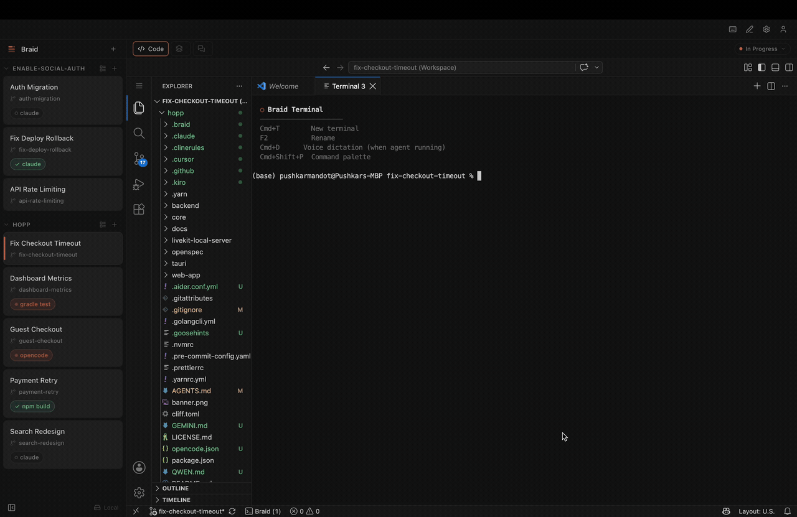
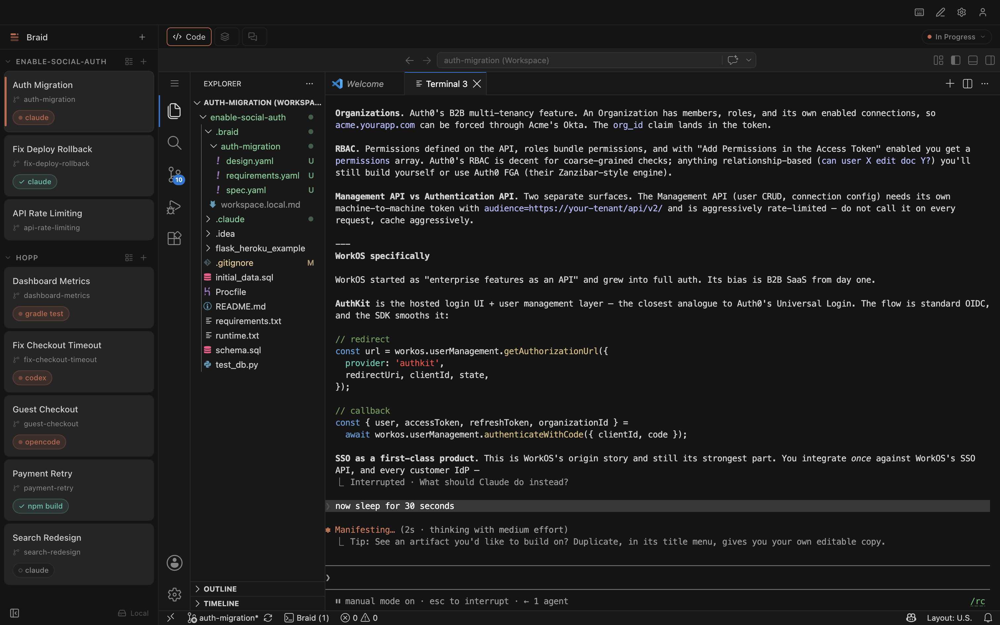
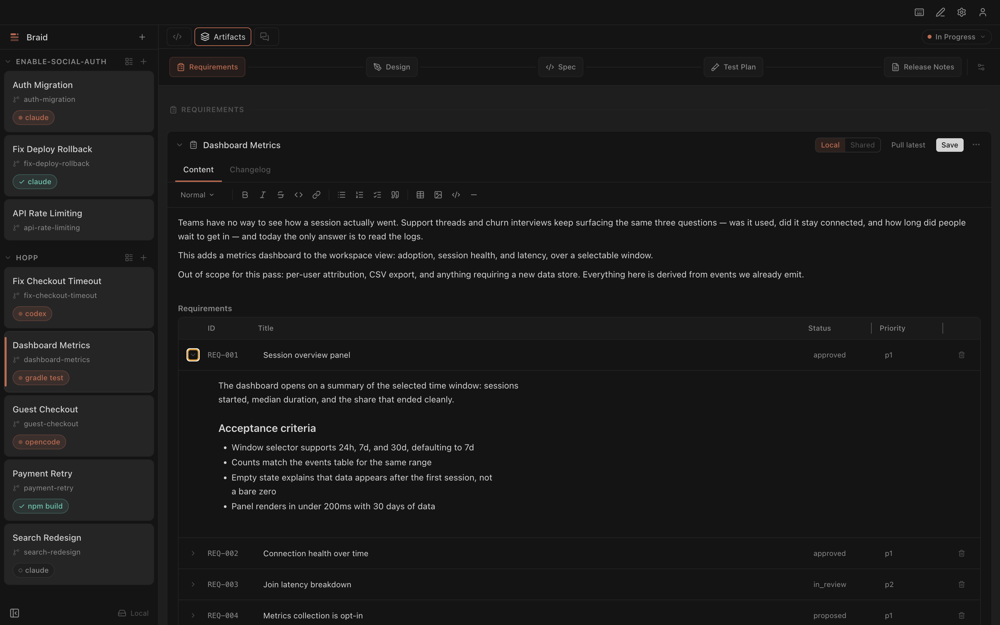
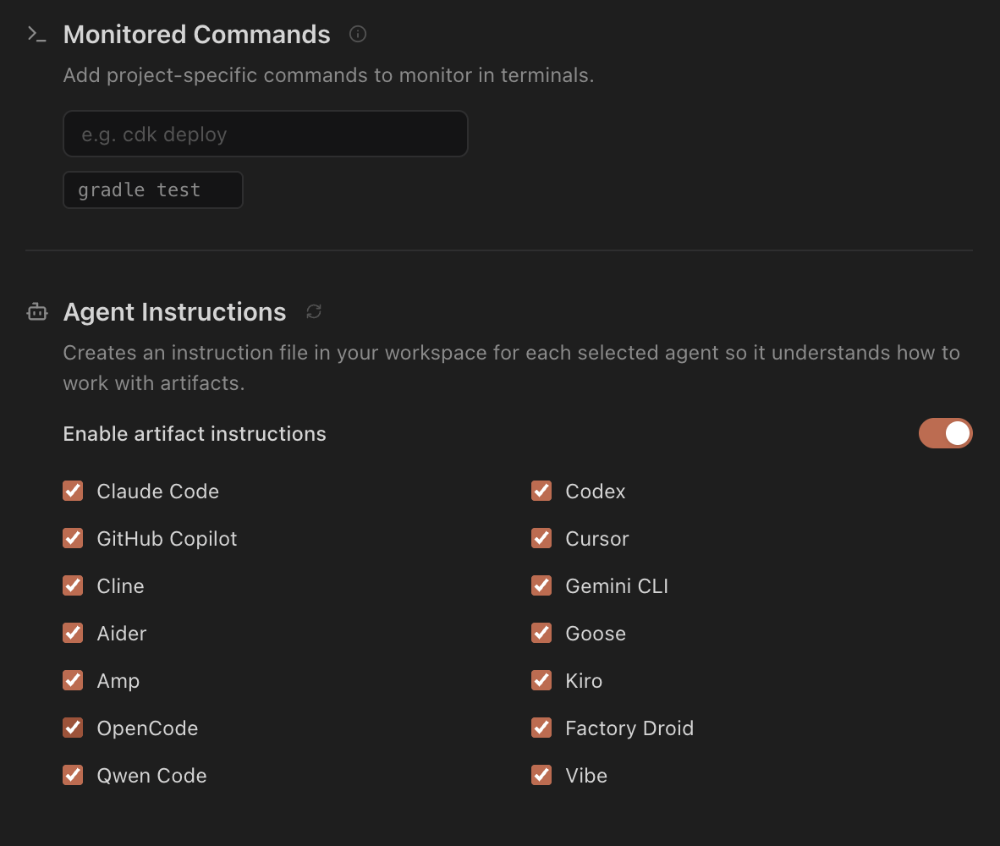

<div align="center">

# Braid

### Mission control for your agent swarm

**Know which agent is working, which is stuck, and which is done.**

[Install](#install) · [Docs](docs/guide/index.md) · [Architecture](ARCHITECTURE.md) · [Contributing](CONTRIBUTING.md)

[](LICENSE)
[-lightgrey.svg)](#install)
[](#status)



</div>

---

## Works with the agent you already use

Braid does not ship an agent. It runs yours, tracks its status, and configures it
to read your project's context files. Fourteen are supported:

| | | | |
|---|---|---|---|
| Claude Code | Codex | Cursor Agent | GitHub Copilot |
| Aider | Gemini CLI | Amp | Goose |
| Cline | Kiro | Qwen Code | OpenCode |
| Vibe | Factory Droid | | |

No configuration. Braid recognises these commands when you type them in a
workspace terminal, and shows you which agent is running, which is waiting on
you, and which has finished.

---

## Install

**Requirements: macOS on Apple Silicon.** The bundled dictation binary is
`darwin-arm64` only, so Intel Macs, Windows and Linux are untested today.

### Download

Get the latest `.dmg` from [**Releases**](https://github.com/openbraid/braid/releases/latest),
open it, and drag Braid to Applications. It is signed and notarized, so it opens
with a normal double-click.

### Or run from source

```bash
git clone https://github.com/openbraid/braid.git && cd braid
npm install
npm run dev
```

The first `npm run dev` downloads the web build of VS Code that Braid embeds and
builds the bundled extension; later runs skip both once they are in place. To
produce your own installable app instead, `npm run build:mac`.

Either way: **no account, no login, no server, no API key.** Braid runs entirely
on your machine and works with your network off. Your identity is
`git config user.name` and `user.email` — the same one already on your commits.

> Braid embeds a VS Code web server. Running from source downloads it on first
> run; the packaged app bundles it. We're working on moving to a fully open
> build — see [What's next](#whats-next).

---

## Why this exists

Three agents running at once is not three times one agent. One is refactoring
payments, one is writing tests for something you specced yesterday, one is
mid-migration. Each is fast on its own. Together they are a set of terminal
windows you have to keep straight in your head: which branch is this one on, what
did I tell it, is it still working or has it been waiting on me for ten minutes.

And when a session ends, the reasoning goes with it — the approach you rejected,
the constraint that made you pick the boring option. Tomorrow you re-explain all
of it to a fresh session. The bottleneck stopped being how fast code gets
written; it is how much context you can hold across parallel agents.

Braid gives every piece of work a **workspace**: its own git branch, its own git
worktree per repo, its own embedded VS Code, its own terminals and agent
sessions. Your original clone is never touched. Five workspaces run side by side
and the sidebar tells you the state of each one at a glance.

---

## Agent context files

Each workspace has a `.braid/` folder in your repo holding YAML files that
describe the work — requirements, design, spec, test plan. These are not
documentation. They are the context you would otherwise retype at the start of
every session, in a format an agent can read and edit directly.

When a workspace opens, Braid writes instruction files into each installed
agent's own rules location (`.claude/rules/`, `.cursor/rules/`, `AGENTS.md`,
`.goosehints`, and so on) so the agent finds these files without being told. No
MCP server, no plugin, no authentication — just files on disk.

`.braid/guest-checkout/requirements.yaml`:

```yaml
meta:
  kind: REQUIREMENTS
  title: Guest Checkout Flow

context: |
  ## Background

  Payment failures account for 12% of checkout abandonment. 60% of failed
  payments come from first-time users who abandoned during account creation.

  ## Approach

  Server-side session management with a 7-day cookie. Account creation is
  offered after purchase, never required before it.

requirements:
  - id: REQ-001
    title: Complete purchase without an account
    status: proposed
    priority: p0
    description: |
      Users can complete a purchase without creating an account.

      ## Acceptance criteria
      - Cart persists via session cookie for 7 days
      - All payment methods available to guest users
      - Order confirmation sent to the provided email
      - Guest orders searchable by email in order lookup

change_log:
  - added: REQ-001 guest checkout
    removed: ''
    why: >-
      Analytics show 40% of users abandon at login. Guest checkout removes that
      friction for first-time buyers while keeping account creation as a
      post-purchase option.
    affects: DESIGN needs guest session handling. TEST_PLAN needs guest flow coverage.
```

The `why` field is the part that pays off. A session next week reads it and knows
which approaches were already rejected and on what grounds.

Because these are plain files on your branch, they travel with your code. Commit
them, open a PR, and reviewers get the spec and the reasoning in the same diff as
the implementation. If you stop using Braid, the files stay and every tool that
reads YAML still works on them.

---

## Optional team server

> **Experimental.** Off by default, absent from a stock install, and not needed
> for anything above.

A self-hosted NestJS server in this monorepo adds live co-editing of artifacts,
inline comments, presence, and project invites. It is early and unstable. Braid's
supported default is local mode.

**Setting it up:** [`apps/server/README.md`](apps/server/README.md) — Docker
quick start, and three shapes depending on who needs to reach it: just you, a
small team over Tailscale, or a public domain with HTTPS. See also
[Collaboration](docs/guide/collaboration.md) for what it adds in the app.

Most of what teams want from collaboration already works through git: artifacts
are files, so review happens in your pull request, history is `git log`, and
conflicts are merge conflicts in a YAML file. The server only earns its keep when
several people need to type into the *same* artifact at the *same* moment.

When a server-backed feature is unavailable, Braid disables the control and says
why, rather than failing with a network error.

---

## Screenshots

<table>
<tr>
<td colspan="2"><br><sub><b>One sidebar, every workspace.</b> Each row is its own branch, worktree, editor and terminals. The pill shows what is running, what has gone quiet, and what has finished.</sub></td>
</tr>
<tr>
<td width="50%"><br><sub><b>Artifacts.</b> The YAML in <code>.braid/</code>, rendered and editable — with the pipeline from requirements through release notes.</sub></td>
<td width="50%"><br><sub><b>Agents.</b> Pick the agents your team uses. Braid writes instruction files into each one's own rules directory.</sub></td>
</tr>
</table>

---

## Documentation

**Using Braid**

- [Getting started](docs/guide/getting-started.md) · [Projects](docs/guide/projects.md) · [Workspaces](docs/guide/workspaces.md) · [Terminals](docs/guide/terminals.md)
- [Artifacts](docs/guide/artifacts.md) — the YAML context files and how agents use them
- [Agent instruction injection](docs/guide/agent-instruction-injection.md) — how Braid configures your agent
- [Setup scripts](docs/guide/setup-scripts.md) · [Keyboard shortcuts](docs/guide/keyboard-shortcuts.md) · [Collaboration](docs/guide/collaboration.md)

**Working on Braid**

- [ARCHITECTURE.md](ARCHITECTURE.md) — how the code is organised, and why
- [CONTRIBUTING.md](CONTRIBUTING.md) — dev setup, layer rules, verification
- [AGENTS.md](AGENTS.md) — context for AI coding agents working in this repo
- [docs/ENGINEERING_GUIDELINES.md](docs/ENGINEERING_GUIDELINES.md) — code conventions
- [CODE_OF_CONDUCT.md](CODE_OF_CONDUCT.md)

## What's next

Roughly in order. Issues and PRs on any of these are welcome.

1. **A fully open editor build.** Braid embeds a VS Code web server;
   [VSCodium](https://vscodium.com) and openvscode-server are the MIT builds of
   the same upstream source. Getting one of them working end to end is the top
   item here.
2. **Widen test coverage.** The main-process libraries, terminal state machine
   and artifact parser are covered; the server and React components are not.
3. **Beyond Apple Silicon.** Intel Macs, Linux and Windows are untested. The
   bundled Whisper dictation binary is `darwin-arm64` only.
4. **Promote a local project to a team server.** IDs are client-generated UUIDs
   in both modes, so this is an upsert rather than a migration — the path exists,
   the button does not.

## Status

Early. macOS Apple Silicon only, and no published release builds yet — build your
own `.dmg` with `npm run build:mac`. Bug reports and PRs are welcome — see
[CONTRIBUTING.md](CONTRIBUTING.md).

## License

[Apache License 2.0](LICENSE). Copyright 2026 The Braid Authors.
